# International Footbal Results Analysis

To analyze the data, the dataset “International football results from 1872 to 2025” was taken from Kaggle. The dataset consists of four parts, but this analysis will only look at the main results.csv dataset.

results.csv includes the following columns:

* date - date of the match
* home_team - the name of the home team
* away_team - the name of the away team
* home_score - full-time home team score including extra time, not including penalty-shootouts
* away_score - full-time away team score including extra time, not including penalty-shootouts
* tournament - the name of the tournament
* city - the name of the city/town/administrative unit where the match was played
* country - the name of the country where the match was played
* neutral - TRUE/FALSE column indicating whether the match was played at a neutral venue

Tasks:

* Who is the best team of all time
* Which teams dominated different eras of football
* What trends have there been in international football throughout the ages - home advantage, total goals scored
* Can we say anything about geopolitics from football fixtures - how has the number of countries changed, which teams like to play each other
* Which countries host the most matches where they themselves are not participating in
* Which team will win?

## Who is the best team of all time

First, we identify the countries with the highest number of wins:
```python
def get_loser(row):
    if row['home_score'] > row['away_score']:
        return row['away_team']
    elif row['away_score'] > row['home_score']:
        return row['home_team']
    else:
        return None
    
df['winner'] = df.apply(get_winner, axis=1)
```
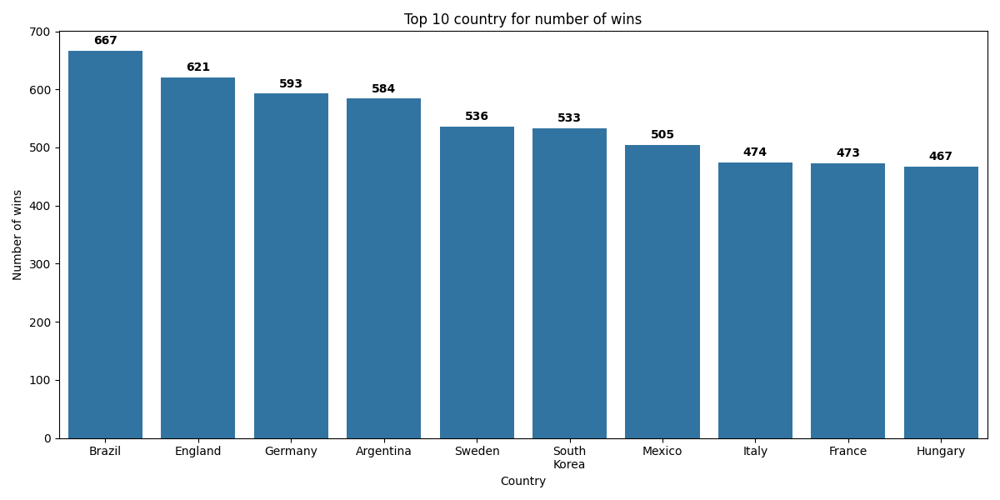

Next, we take into account the total number of matches played and calculate the win percentage (excluding countries that played fewer than 100 matches):
```python
df['winner'] = df.apply(get_winner, axis=1)
df['looser'] = df.apply(get_looser, axis=1)
game_counts = pd.concat([df['winner'], df['looser']]).value_counts()

win_counts = df['winner'].value_counts()
win_percent = (win_counts / game_counts * 100).dropna()

MIN_GAMES = 100
eligible_countries = game_counts[game_counts >= MIN_GAMES]

win_percent = win_percent[eligible_countries.index].sort_values(ascending=False)
```
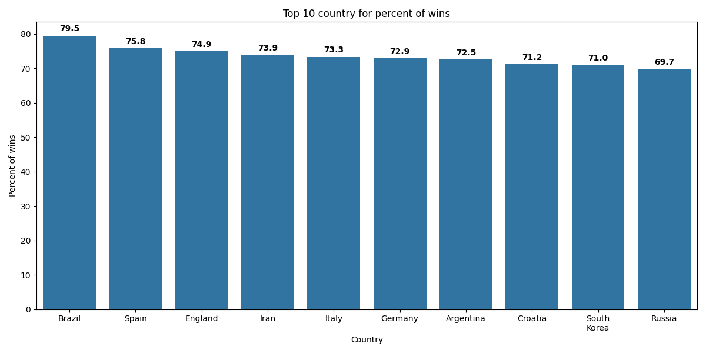

Now we do the same, but only include major tournaments:

* FIFA World Cup

* FIFA World Cup qualification

* UEFA Euro

* UEFA Euro qualification

* Copa América

* UEFA Nations League

* African Cup of Nations

* AFC Asian Cup

* Gold Cup

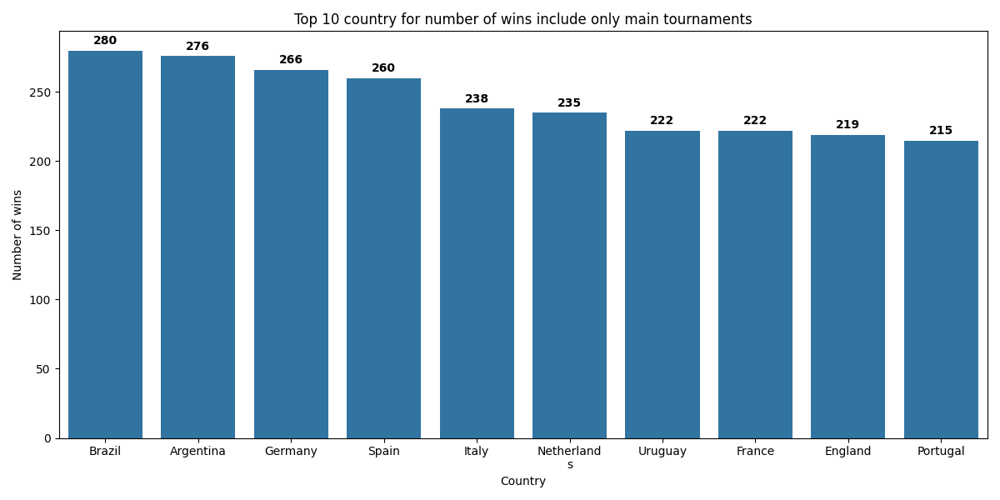

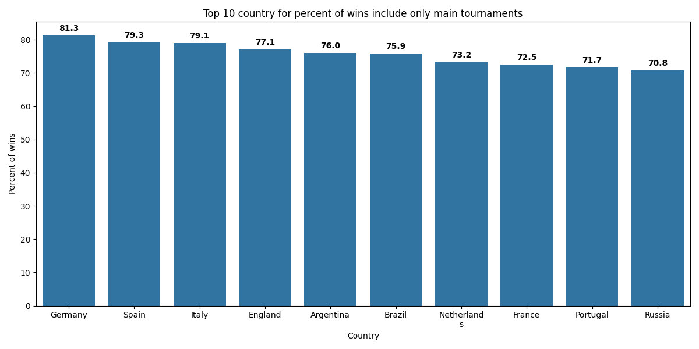

For further analysis, only these tournaments will be considered.

## Which teams dominated different eras of football

We divide the dataset into football eras and analyze the results for different periods:

```python
    FOOTBALL_ERAS = [1950, 1960, 1975, 1990, 2005, 2015, 2025]
    for start, end in zip(FOOTBALL_ERAS, FOOTBALL_ERAS[1:]): 
        analys_mathes_wins(
            df[(df['date'].dt.year > start) & (df['date'].dt.year <= end)], 
            f'from {start} to {end}',
            0 if start <= 1975 else 100
        )
```

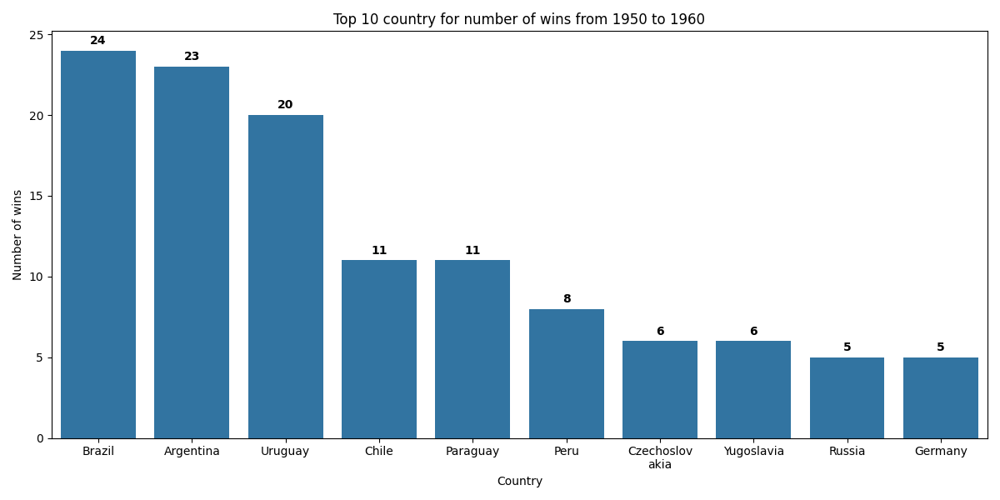

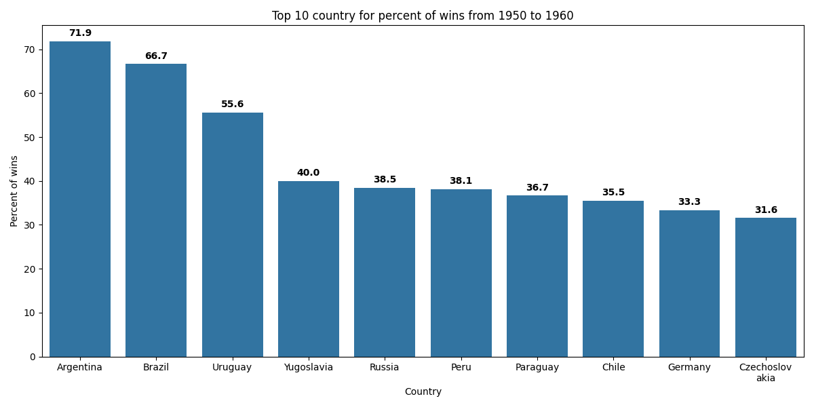

In the classical era, both in terms of total wins and win percentage, Brazil, Argentina, and Uruguay clearly dominated with a significant margin.

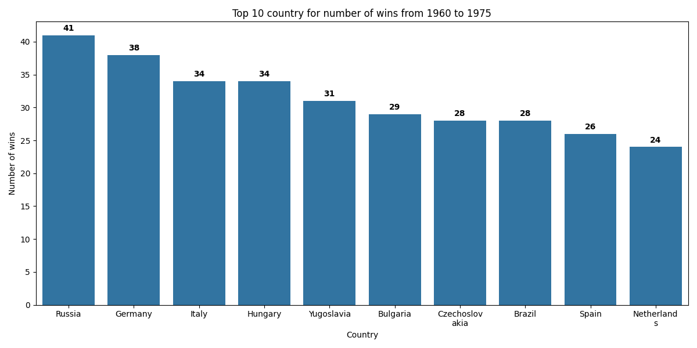

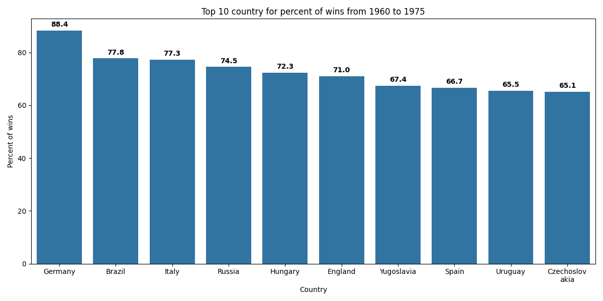

Between 1960 and 1975, the Soviet bloc dominated in terms of wins, specifically Hungary, Yugoslavia, and Czechoslovakia (shown as Russia on the chart). Brazil also appears at the top, as this period marks the peak of its dominance. Germany and Italy also occupy leading positions.


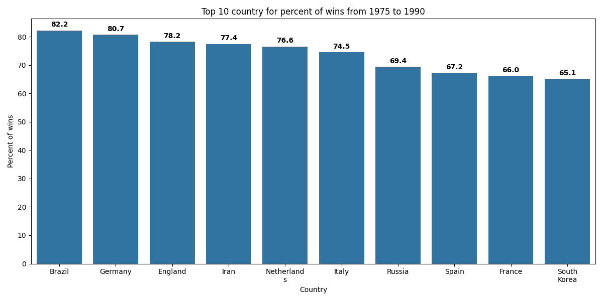

The Netherlands recorded the highest number of wins, as they consistently succeeded in qualification tournaments and won Euro 1988. Germany once again placed second, having reached two consecutive World Cup finals (1982 and 1986). In terms of win percentage, Brazil and Germany remained dominant.

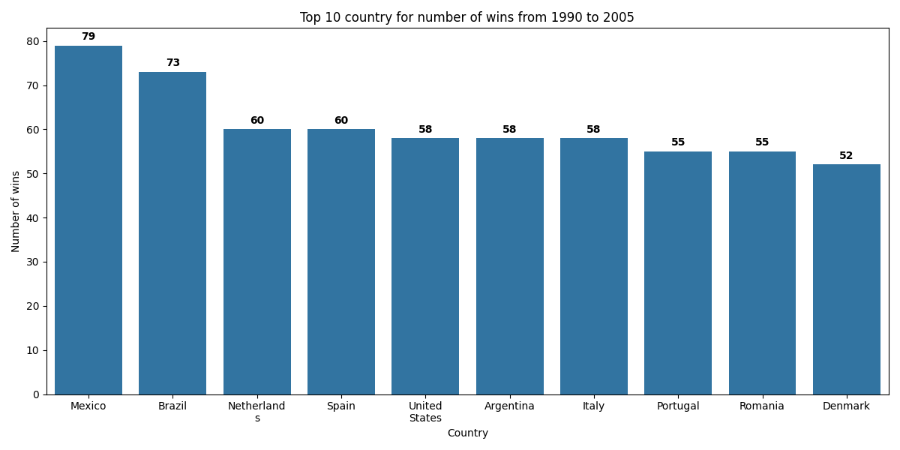

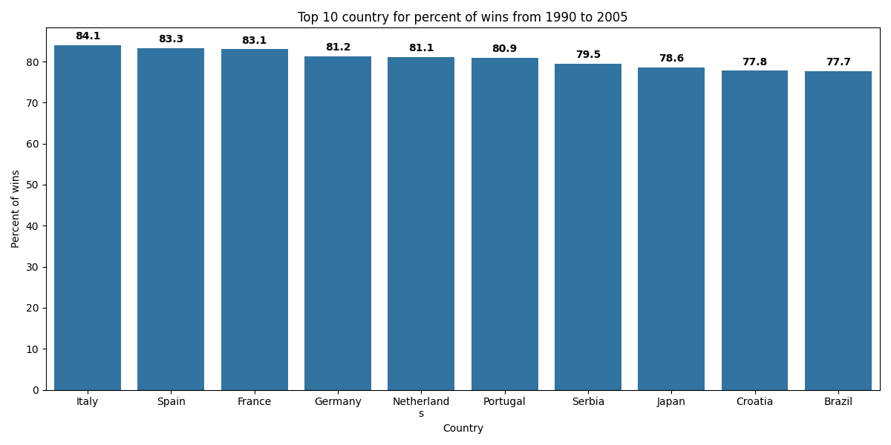

Mexico’s leadership in total wins may seem surprising, but it is explained by the fact that the Mexican national team plays a very large number of matches each year, often against weaker opponents, allowing them to accumulate many victories. European teams such as the Netherlands, Spain, and Italy traditionally maintain strong results. Brazil ranks second in total wins.

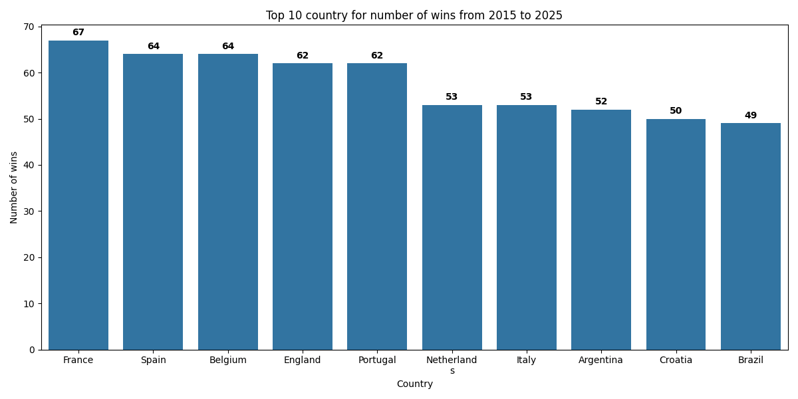

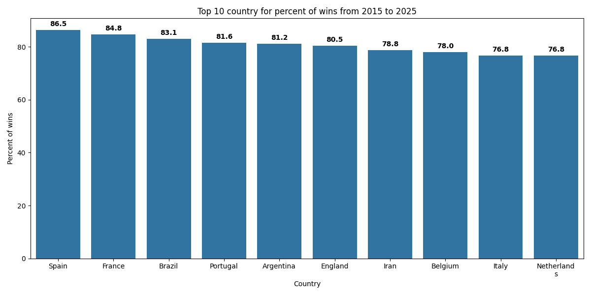

The chart covering the period up to the end of 2025 shows that Spain, France, and Belgium are the leading teams of this era. Brazil also achieved a high win percentage.

## What trends have there been in international football throughout the ages - home advantage, total goals scored

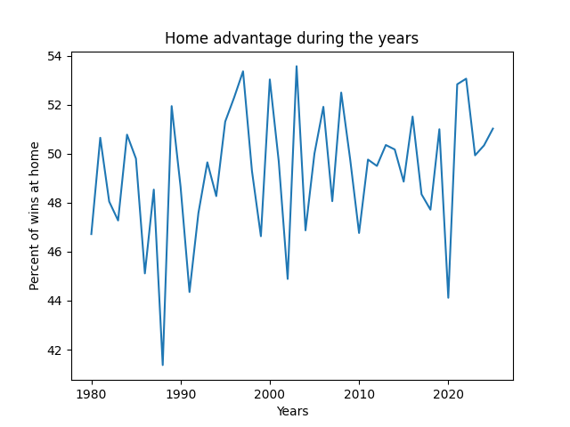

Although the line on the chart appears chaotic, it clearly shows a transition from an era in which home teams dominated to the modern game, where the advantage is minimal. In the 1980s, the win rate of teams playing at home often fluctuated between 55–60%. Toward the end of the chart (the 2020s), these values increasingly drop to 45–50%. This indicates that playing at home is becoming less advantageous.

A deep dip is visible around 2020, when the value falls to nearly 40%. This is a direct consequence of the COVID-19 pandemic, during which matches were played behind closed doors. Without fan support, home advantage virtually disappeared, supporting the theory of psychological pressure from crowds on players and referees. Since only major tournaments are considered, the number of matches per year is relatively small, meaning that results from just a few tournaments can significantly affect annual statistics.

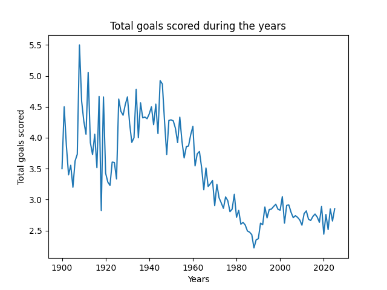

At the beginning of the 20th century, average goal scoring was very high, often exceeding 4–4.5 goals per match, reflecting the dominance of attacking tactics. From 1960 to 1980, a clear downward trend in goal scoring is observed. The lowest point was reached in the late 1980s (around 2.2 goals per match), marking the peak of defensive systems. From the 2000s onward, the metric stabilized in the range of 2.5–2.8 goals per game. Football became more balanced.

##  Geopolitics from football fixtures

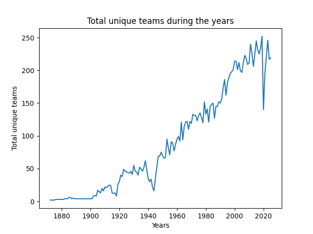

Analyzing the number of countries participating in international competitions shows that initially the line is almost flat, with a small rise in the early 1900s. At that time, football was primarily a British pastime. Only with the start of the Olympic Games and the founding of FIFA in 1904 did the first national teams outside Britain emerge (France, Belgium, Denmark).

During World War I (1914–1918), there is a sharp decline, as countries were focused on war and international travel was disrupted. The same applies to World War II (1939–1945). During decolonization, countries in Africa, Asia, and the Caribbean gained independence from Britain, France, and other empires. One of the first steps a new state takes for international recognition is creating a flag, an anthem, and a national football team to join FIFA.

From the 1990s onward, a noticeable jump occurs following the collapse of the USSR, which resulted in the emergence of 15 new national teams. In 2020, a strong anomaly appears: most international matches were canceled due to the pandemic, significantly reducing the number of teams involved.

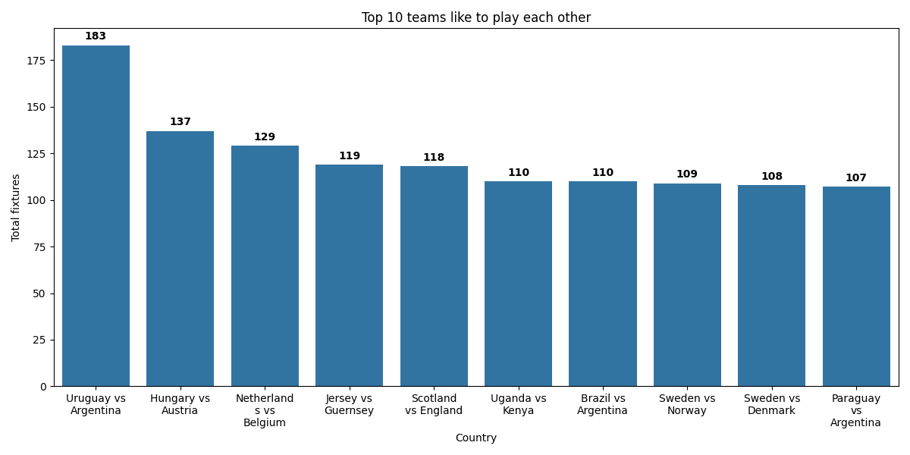

The chart clearly shows that teams most frequently play against their neighbors. This is logical from a logistical perspective (travel was historically difficult) and due to regional tournaments (Copa América, European Championship, etc.).

Latin America: the leading rivalry is Uruguay vs Argentina (183 matches), as well as Brazil vs Argentina. These are historic clásicos that have existed for over a century. Pairings such as Hungary vs Austria (a legacy of the Austro-Hungarian Empire) and Sweden vs Norway / Denmark represent classic regional derbies.

## How much, if at all, does hosting a major tournament help a country's chances in the tournament

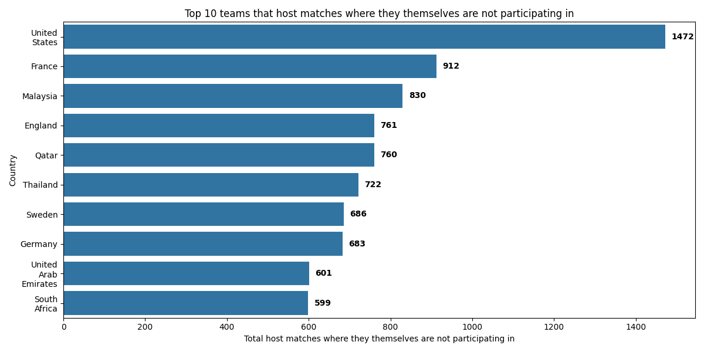

На графіку видно, що Споулчені Штати з величезним відривом займають перше місце. Це пояснюється тим, що в США надзвичайно розвинена спортивна інфраструктура, і там часто проводяться комерційні турніри або товариські матчі топ-клубів Європи. Високі показники Франції (912) та Англії (761) можуть бути пов'язані з проведенням фіналів єврокубків або матчів збірних-сусідів. Південно-Східна Азія: Малайзія (830) та Таїланд (722). Ці країни часто приймають регіональні кубки або передсезонні турніри європейських грандів. Близький Схід: Катар (760) та ОАЕ (601). Це логістичні хаби, які активно інвестують у проведення міжнародних спортивних подій.

## Which team will win?

Для передбачення результату матчу була обрана модель RandomForest, адже вона ідеально підійде для складних зв'язків такі як врахування останніх матчів чи останніх head two head матчів.

Передбачувати ми будемо колонку order_result, де 
* 1 — перемога тієї команди чия назва за алфавітом наступна; 
* 0 — нічия;
* -1 — програш тієї команди чия назва за алфавітом наступна.

```python
def get_order_result(row):
    if row['home_score'] == row['away_score']:
        return 0
    is_home_win = row['home_score'] > row['away_score']
    is_home_first = row['home_team'] > row['away_team']
    return 1 if is_home_win == is_home_first else -1

df['order_result'] = df.apply(get_order_result, axis=1)
```

Для початку перетворимо команди у каталог, щоб його міг використати RandomForest

```python
le_team = LabelEncoder()
    all_teams = pd.concat([df['home_team'], df['away_team']])
    le_team.fit(all_teams)
    df['home_team_enc'] = le_team.transform(df['home_team'])
    df['away_team_enc'] = le_team.transform(df['away_team'])
```

Далі отримаємо останні h2h матчі:

```python
def get_h2h_last_wins(df, match_result, last_n):
    return (
        df
        .groupby('home_and_away_team')['order_result']
        .transform(
            lambda x: (
                (x==match_result)
                .rolling(last_n, min_periods=1)
                .sum()
                .shift(1)
                .fillna(0)
            )
        )
    )
```

І просто останні матчі команди, перед цим зробивши векторизоване групове транспонування:

```python
def get_last_wins(df, match_result, last_n):
    return (
        df
        .groupby('team')['result_team']
        .transform(
            lambda x: (
                (x==match_result)
                .rolling(last_n, min_periods=1)
                .sum()
                .shift(1)
                .fillna(0)
            )
        )
    )
```

Використаємо RandomForest

```python
TRAIN_PERCENT = 0.8
    train_index = int(len(x) * TRAIN_PERCENT)
    x_train = x.iloc[:train_index]
    x_test = x.iloc[train_index:]
    y_train = y.iloc[:train_index]
    y_test = y.iloc[train_index:]
    model = RandomForestClassifier(n_estimators=200, random_state=42)
    model.fit(x_train, y_train)
    y_pred = model.predict(x_test)
```

В результаті бачимо, що Accuracy: 0.5263319357807547. Враховуючи, що ми маємо мінімальну кілкьість даних про матч, це досить непоганий показник.